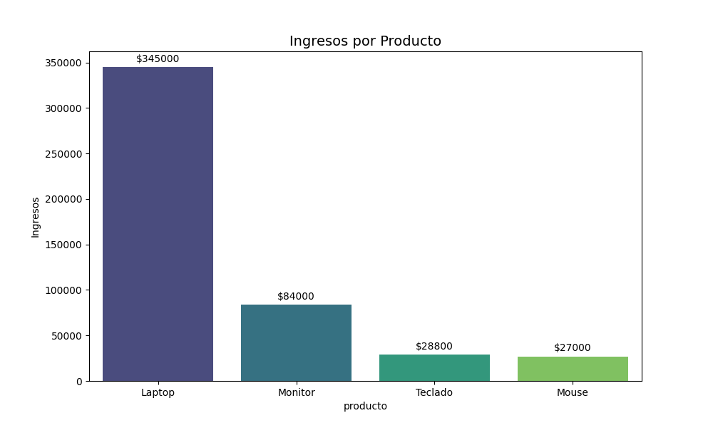
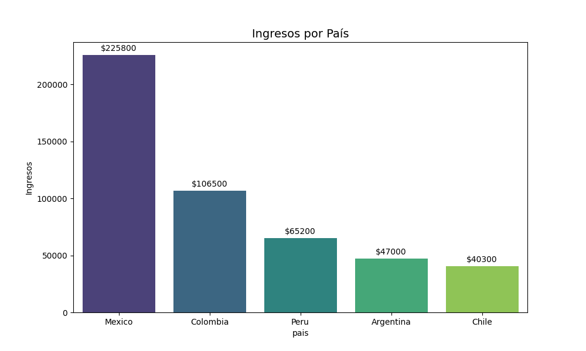
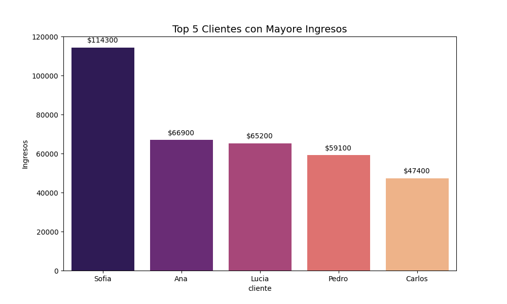
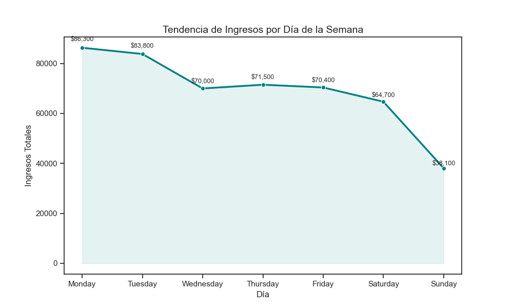

# Automated Reporting Pipeline

## Descripción

Pipeline automatizado desarrollado en Python para procesar datos de ventas, realizar limpieza y transformación de información, generar visualizaciones y producir reportes ejecutivos en formato PDF.

El objetivo del proyecto es transformar datos brutos almacenados en archivos CSV en información útil para la toma de decisiones mediante un flujo automatizado de análisis y reporting.

---

## Funcionalidades

* Carga automática de archivos CSV.
* Validación de estructura y calidad de datos.
* Limpieza y transformación de información.
* Eliminación de registros duplicados.
* Conversión y validación de fechas.
* Cálculo automático de ingresos.
* Análisis de ventas por producto.
* Análisis de ventas por país.
* Identificación de clientes con mayor valor.
* Análisis temporal por día de la semana.
* Generación automática de visualizaciones.
* Generación de reportes ejecutivos en formato TXT y PDF.
* Registro de eventos y errores mediante sistema de logs.

---

## Tecnologías Utilizadas

* Python
* Pandas
* Matplotlib
* Seaborn
* ReportLab

---

## Estructura del Proyecto

```text
Automated-Reporting-Pipeline
│
├── datos/
│   └── ecommerce_data.csv
│
├── outputs/
│   ├── reporte.pdf
│   ├── grafica_producto.png
│   ├── grafica_pais.png
│   ├── grafica_cliente.png
│   └── grafica_temporal.png
│
├── mini_proy.py
├── requirements.txt
└── README.md
```

---

## Flujo del Proyecto

```text
CSV
 ↓
Carga de Datos
 ↓
Validación
 ↓
Limpieza
 ↓
Transformación
 ↓
Análisis
 ↓
Visualizaciones
 ↓
Reporte PDF
```

---

## Dataset

El repositorio incluye un dataset de ejemplo (`ecommerce_data.csv`) utilizado para demostrar el funcionamiento del pipeline.

El sistema fue diseñado para procesar automáticamente uno o múltiples archivos CSV con información de ventas.

---

## Resultados Generados

Al ejecutar el proyecto se generan automáticamente:

* Reporte ejecutivo en PDF.
* Reporte ejecutivo en TXT.
* Gráfica de ingresos por producto.
* Gráfica de ingresos por país.
* Gráfica de clientes con mayor valor.
* Gráfica de tendencia temporal.
* Archivo de logs para seguimiento de ejecución.

---

## Visualizaciones

### Ingresos por Producto



### Ingresos por País



### Top Clientes



### Tendencia Temporal



---

## Evolución del Proyecto

Este proyecto comenzó como una herramienta básica para analizar ventas y generar visualizaciones a partir de archivos CSV.

Durante su evolución se incorporaron mejoras enfocadas en automatización, calidad de datos y generación de reportes ejecutivos, incluyendo:

* Procesamiento automático de múltiples archivos CSV.
* Validación de columnas obligatorias.
* Limpieza y transformación de datos.
* Revisión de calidad mediante estadísticas descriptivas.
* Cálculo automático de KPIs de negocio.
* Generación de visualizaciones automatizadas.
* Creación de reportes ejecutivos en PDF.
* Sistema de logging para monitoreo y diagnóstico de errores.
* Mayor robustez y tolerancia ante datos inválidos.

El resultado final es un pipeline automatizado capaz de transformar datos brutos en información accionable para la toma de decisiones empresariales.

---

## Cómo Ejecutar el Proyecto

### 1. Clonar repositorio

```bash
git clone https://github.com/TU-USUARIO/Automated-Reporting-Pipeline.git
```

### 2. Instalar dependencias

```bash
pip install -r requirements.txt
```

### 3. Ejecutar el proyecto

```bash
python auto_report_pipeline.py
```

### 4. Consultar resultados

Los archivos generados estarán disponibles dentro de la carpeta:

```text
outputs/
```

---

## Habilidades Demostradas

* Data Cleaning
* Data Transformation
* Data Analysis
* Exploratory Data Analysis (EDA)
* Data Visualization
* Business Intelligence
* Report Automation
* ETL Fundamentals
* Python Programming
* Report Generation

---

## Autor

José Ignacio Peña Rodríguez

Data Analyst Junior | Python | SQL | Power BI | Business Intelligence
